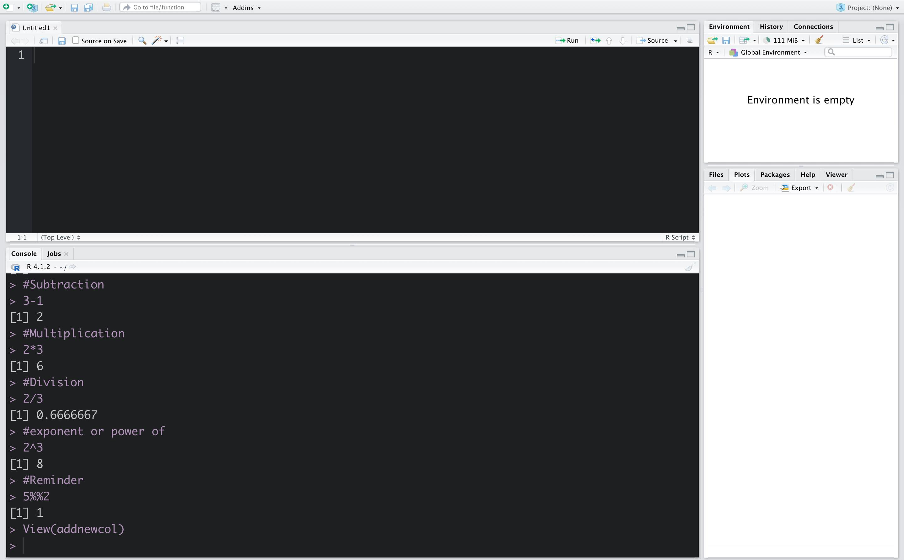

## Introduction-to-R-programming-basics

In this repository I will discuss briefly about R programming basic as far as I have learned. Normally I will show in practical way. Let's go to started-

### Arithmetric in R:

Here I have shown basic arithmetic property. 

